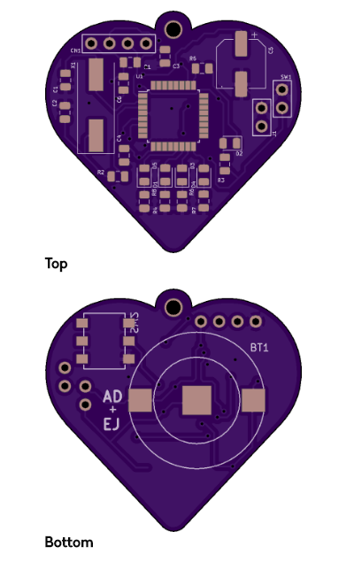
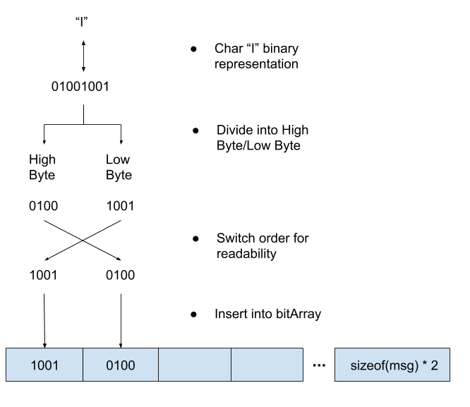
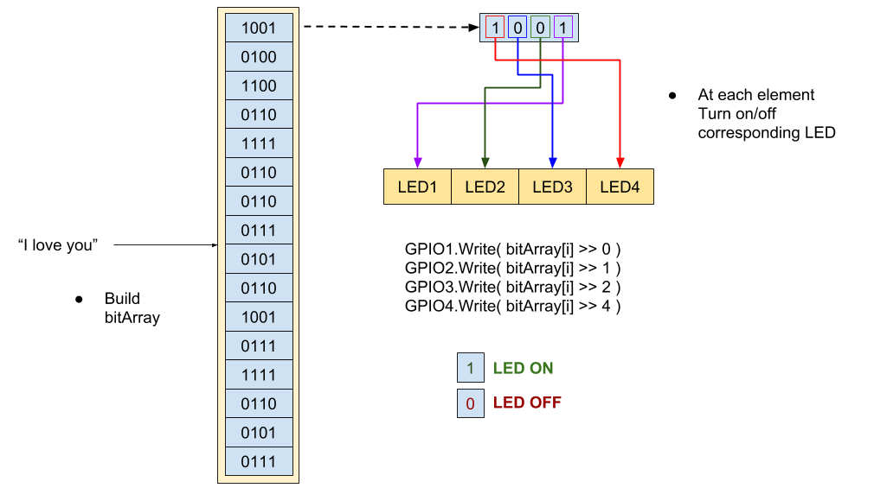

# heart-pcb

## Project Information
Heart PCB is a device that uses a STM8S003K3 Microchip to do bit-level control of a set of LEDs to display an input message in half-byte binary

### Software utilites
#### STM8S003K3 Programming

Programming of the STM8S003K3 was done using ST Visual Develop (STVD) and utilized ST Visual Programming (STVP). In addition it requires the Cosmic Compilier software.

> https://www.st.com/en/development-tools/stvd-stm8.html

> https://www.st.com/content/st_com/en/products/development-tools/software-development-tools/stm8-software-development-tools/stm8-programmers/stvp-stm8.html

> http://www.cosmicsoftware.com/download.php

I initially followed along with the STM8SVLDISCOVERY discovery board tutorial to program the STM8S003K3

> https://www.st.com/content/ccc/resource/technical/document/user_manual/53/20/92/c8/ad/57/45/e8/DM00040678.pdf/files/DM00040678.pdf/jcr:content/translations/en.DM00040678.pdf

#### PCB Development

The printed circuit board was designed using KiCAD, the Gerber files can be found at 

> [Gerber File Location](Gerbers/)

## Technical Information
### PCB Development

#### Electrical Schematic 

#### PCB Board Layout

### Software Development

The STM8S003K3 MCU is programmed to blink the 4 display LEDS(2-5) to display a message in half-bit binary at 0.5 Hz frequency. Below is an explaination on how it does this.

* Loop through the char * message and look at each individual char. 
* Each char is an 8 bit sequence, which will first be broken down into a "high byte" and "low byte". These are really a high half-byte and low half-byte as they are only 4 bits each. 
* The high byte and low byte will be switched, because humans read binary starting at the 0th bit, which is the right most bit, so we will want to switch high/low to make more sense to us
* These are now inserted into a bitArray, which is of length 2*length(message)

* Once the bitArray is fully built it proceeds to the main loop of LED control
* Each element of the bitArray is taken and each individual bit is then used to turn on/off an LED. Again because humans read right o left the LED1 (left-most on the PCB) corresponds to bit0, and LED4 (right-most on the PCB) corresponds to bit3

